# Toy Trader

### **Identification of the problem you are trying to solve by building this particular marketplace app.**

Households with children across Australia (I'd go as far as to say worldwide), deal with the problem of being over cluttered by toys. Many that are not utilised as children outgrow those toys or as the novelty of the toys wears off. Some are broken or have pieces missing but parents and carers can't bring themselves to bin them as toys have become very costly in 2022. On the other hand, parents need educational toys to challenge their kids as they grow or parts of toys to make their current toys whole.

Toy Trader aims to solve the following problems:
- Allow the user to sell unwanted toys whilst making some money
- Declutter their home without feeling guilty about wastage
- Sell double ups your child has been gifted
- Sell broken toys for parts if they are in less than good condition
- Find toys sold for parts that fix their current toys
- Buy toys in good to mint condition at more affordable prices

### **Why is it a problem that needs solving?**

This is a problem that needs solving first for the global problem of reducing the release of carbon emissions from the creation of new toys and also reducing the amount of plastic waste dumped into oceans and landfill sites. It's no secret plastic toys are bad for the environment.

Another issue is when a child really wants a toy and receives it but the novelty wears off very quickly, the person who bought the toy might be upset that an expensive toy is now sat at the bottom of a toy box not being played with.

Children also outgrow toys, what was a great toy one year and helped the child learn new skills is now a boring toy but is still in good condition and can be useful to another child. These toys can be offered on Toy Trader and be valued and appreciated by another child.

Toys can be quite an expensive investment however, Toy Trader is a great source to buy toys in good to mint condition at a more affordable price.

The three key problems that Toy Trader hopes to help solve are:
1. The global issue of recycling, reducing and reusing 'waste' products 
2. Providing a means to sell unwanted toys to make cash 
3. Providing a means to buy toys at affordable prices or for parts

### **Access Toy Trader**
[Toy Trader](https://staging-toytrader.herokuapp.com/) 
[Github repo](https://github.com/HardeepSinghAu/toy_swap)

### **Description of Toy Trader:**
**Purpose**

A site where Users can connect, as Buyers, Sellors or both or simply browse.

**Functionality / features**

Toy trader has several features including:
- A seamless Sign-up and logging in process
- Product listing
- Product details page
- Orders page
- Sales Page

  

**Sitemap of Toy Trader**

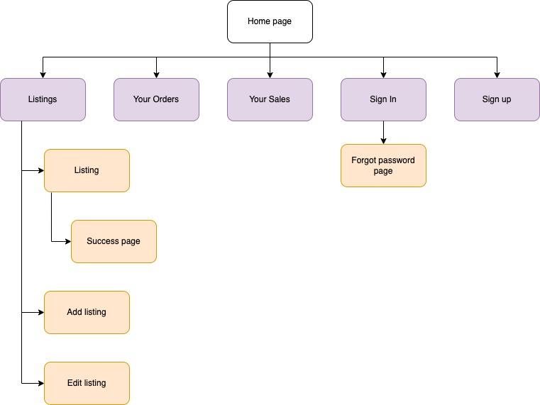

**Screenshots of Toy Trader site live**
>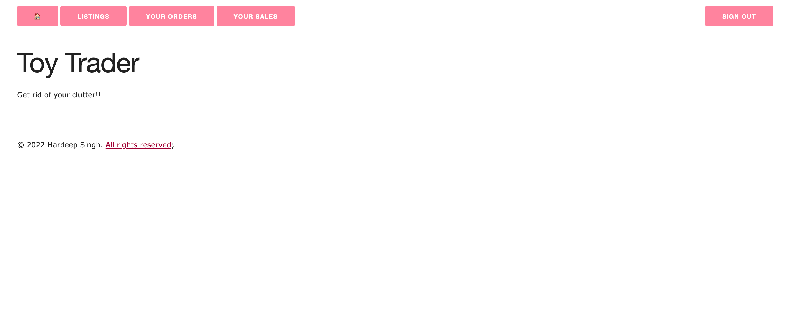

>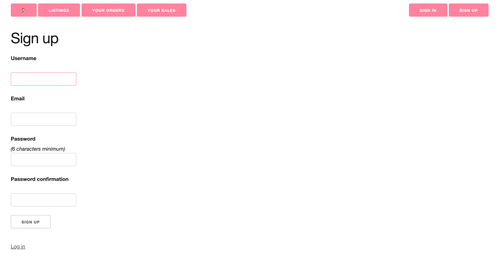

>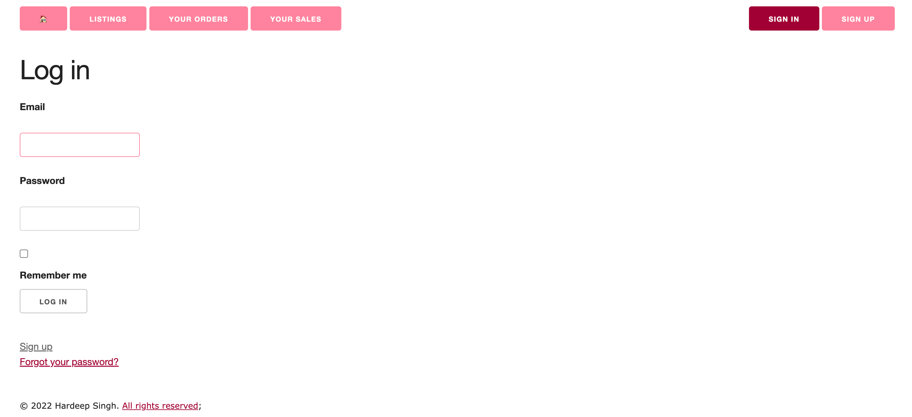

>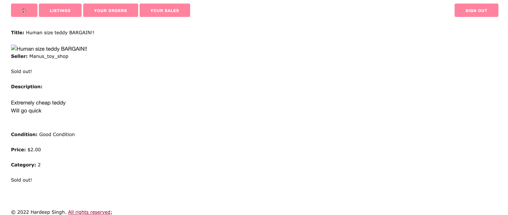

>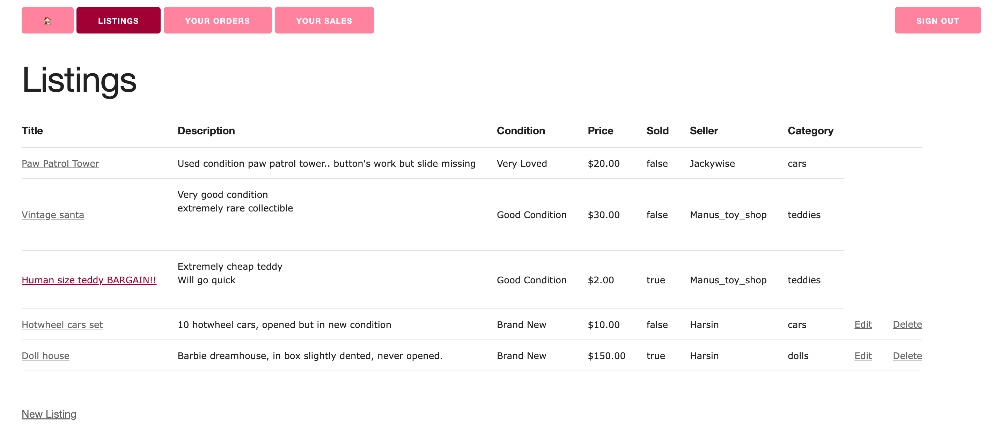

>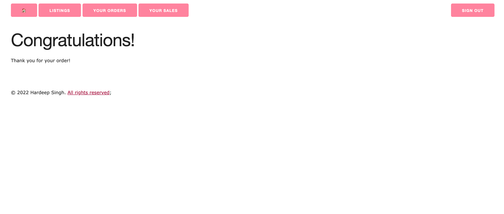

> 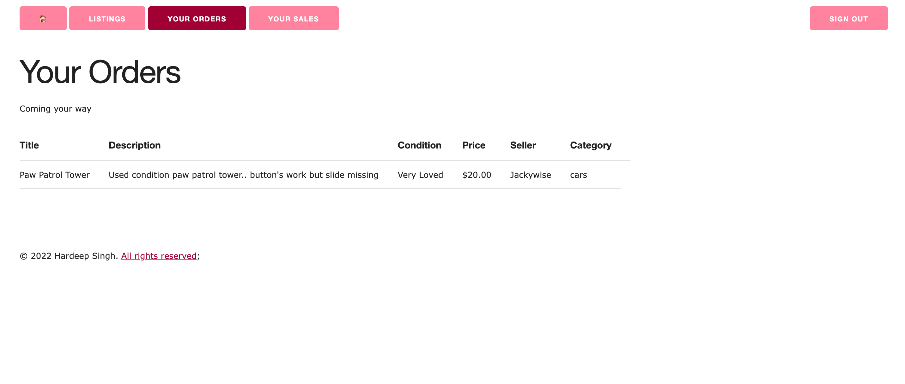

>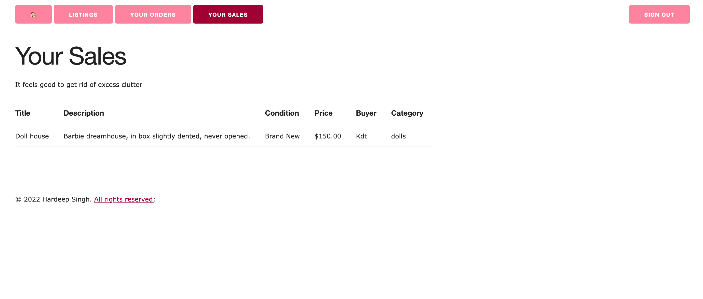

**Target audience**

Toy trader has a somewhat limited target audience, unlike a marketplace that includes the sales of all types of products. Toy Trader is solely for toys for kids and that narrows the audience from everyone down to Users who have a child in their life such as:
- Mums and Dads
- Carers and Guardians
- Grandparents, Aunts and Uncles
- Anyone else with a child in their life

The exception to this rule might be adults who love legos but are missing pieces from their sets or might be searching for vintage toys.

**Tech stack**

Toy Trader uses a simple but scalable tech stack which consists of: 

- Front End:
    - HTML
    - SCSS/SASS
    - CSS

- Back End:
    - Ruby on Rails
    - PostgreSQL 

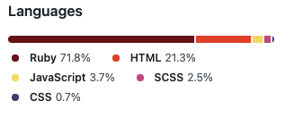

For Version control and Deployment:
- Heroku 
- Github

### **User stories for Toy Trader**

1. As a person with a child, I'm very time poor and I want an app that is quick and easy to sign up, login and list on. 

2. As a Mum, I want to get rid of a few excess toys so that I can get rid of clutter and make a bit of change.

3. As a parent, I want to buy some good quality toys, without breaking the bank.

4. As a Dad, I want to sell some toys that still have some good working parts and can be recycled, because recycling is good for the planet.

5. I want to be able to find affordable educational toys to support my childs learning, he outgrowns educational toys very quickly. I suppose I can sell these on the same app as well.

6. As a grown up with some classic and expensive lego sets, I would like to buy extra pieces for cheap to add to my sets.

### **Wireframes for Toy Trader**

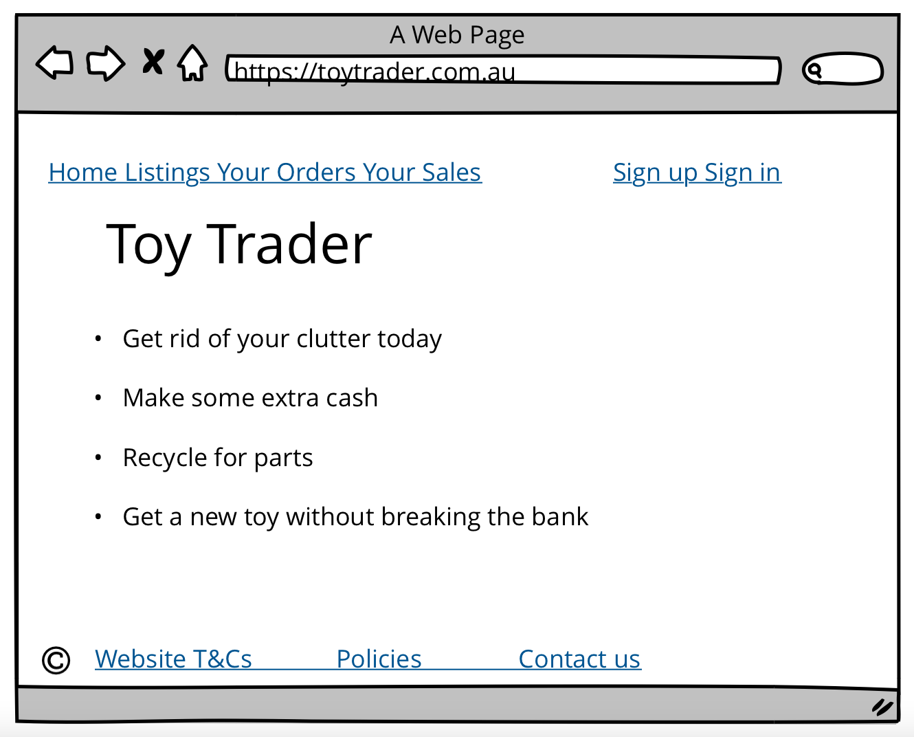
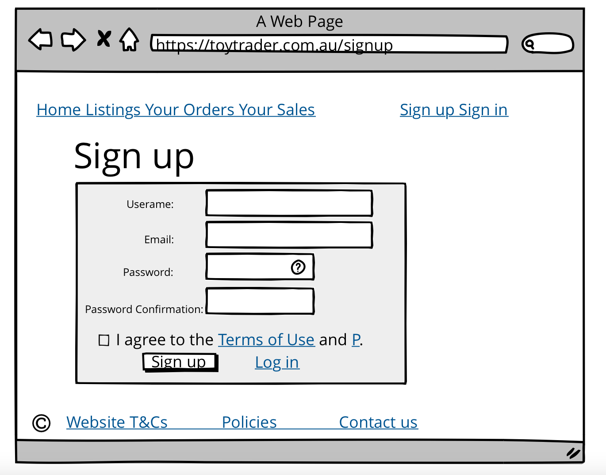
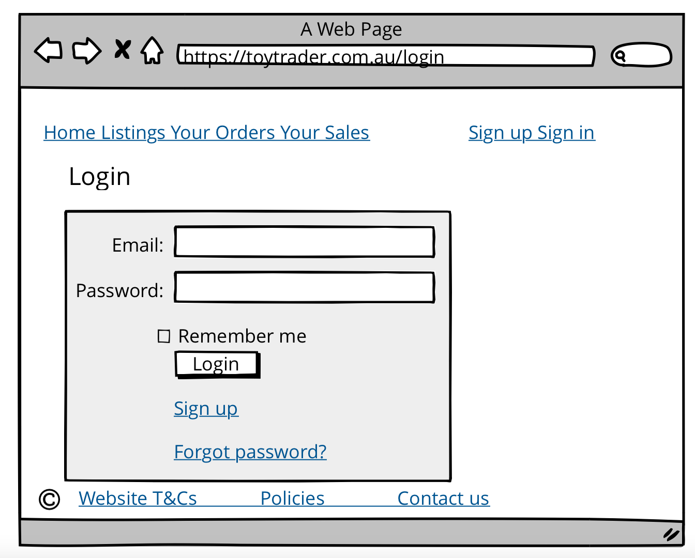
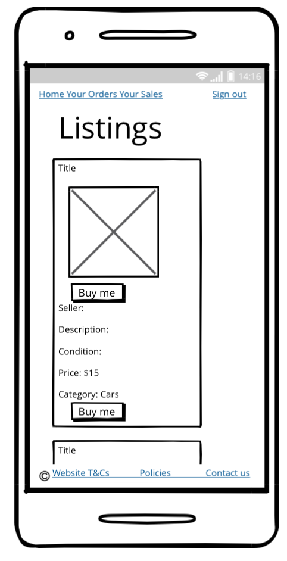
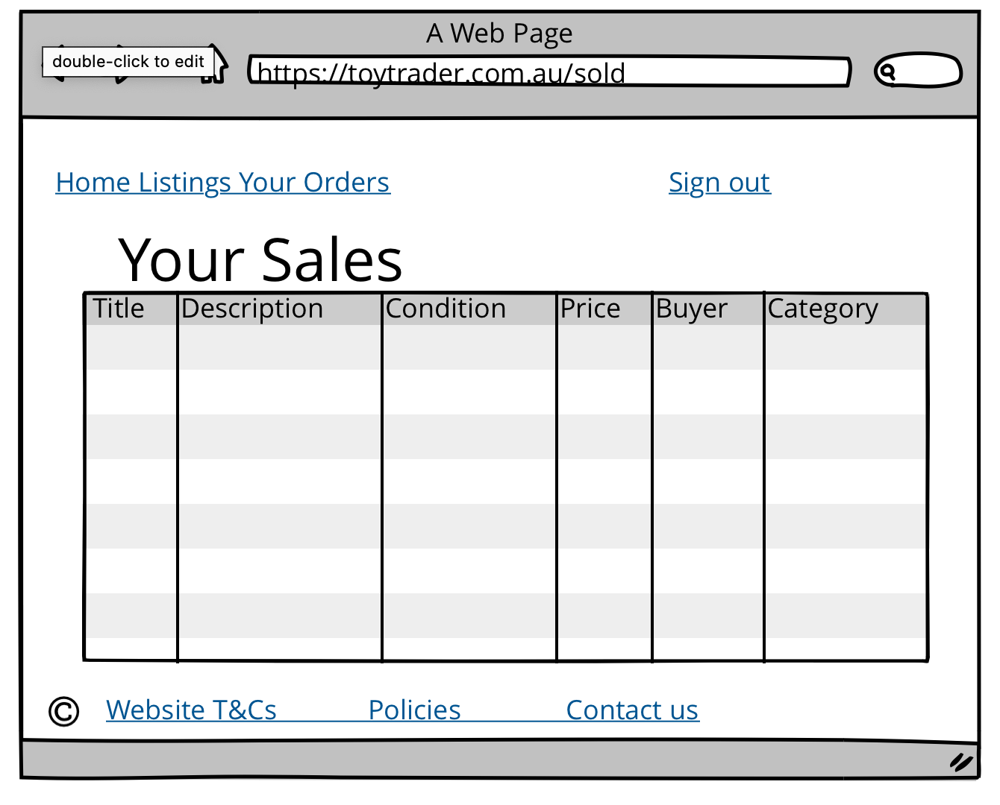
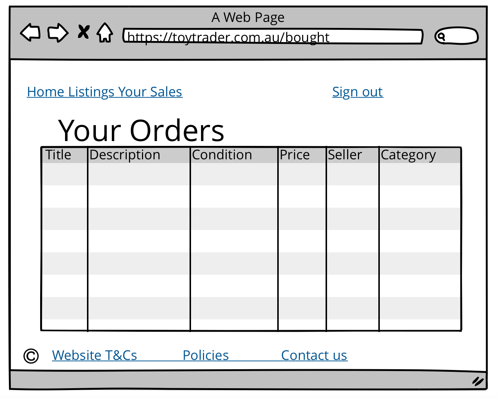

###	**An ERD for Toy Trader**

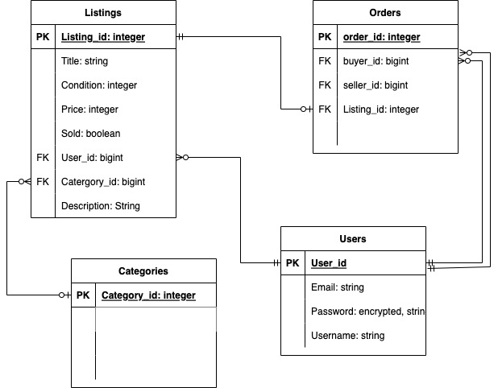

###	**Explain the different high-level components (abstractions) in Toy Trader**

This app has an MVC (Model View Controller) architecture, following the rule of separation of concerns.
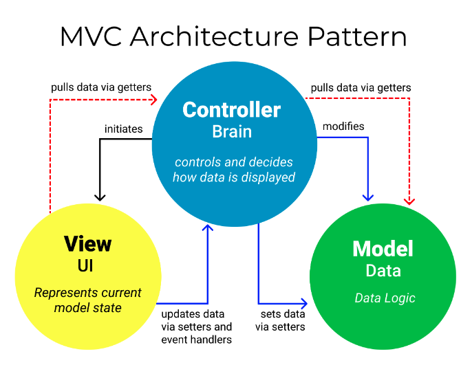  
*Source: Hernandez, Rafael D. “The Model View Controller Pattern – MVC Architecture and Frameworks Explained.” FreeCodeCamp.org, 19 Apr. 2021, www.freecodecamp.org/news/the-model-view-controller-pattern-mvc-architecture-and-frameworks-explained/.*
 
*Abstraction* is an object-oriented programming concept, where only the essential components are visible and accessible. Anything that is unnecessary is abstracted (hidden) away.
 
*Inheritance* in rails is when a class inherits(receives) the attributes(behaviours) of another class.
 
Within this app, the Application Controller inherits from the Action Controller Base.
 
> ApplicationController < ActionController::Base  
ListingsController < ApplicationController  
OrdersController < ApplicationController  
PagesController < ApplicationController

The Devise Controller is abstracted away as per good practice.
 
The ListingsController, Orders Controller and Pages Controller all inherit from the Application Controller in this app. They are inheriting the before action and permitted parameters from the Application Controller.

The Application Record Model inherits from the Active Record Model.

> ApplicationRecord < ActiveRecord::Base
Category < ApplicationRecord
Listing < ApplicationRecord
Order < ApplicationRecord
User < ApplicationRecord

The Catefgory Model, Listing Model, Order Model and User Model all inherit from the Application Record Model

###	**Detail any third party services that Toy Trader will use**
- Devise: is a rails gem that handles user authentication
- AWS S3: an external object storage service 
- Heroku: a cloud platform for all-in-one web hosting

###	**Describe the Toy Trader projects models in terms of the relationships (active record associations) they have with each other**

Active records belongs_to has_many

A User has many listings, it has many sold orders and it has many bought orders. This is represented in the user.rb file in the models folder as:

> User
has_many :listings
  has_many :sold_orders, foreign_key: "seller_id"
  has_many :bought_orders, foreign_key: "buyer_id"
  
A listing belongs to a User, it belongs to a category and has one picture attached and a rich text description. It is represented in the listing.rb file in the Models folder as:

> Listing
  belongs_to :user
  belongs_to :category
  has_rich_text :description
  has_one_attached :picture

An Order belongs to a listing, it belongs to a buyer and a seller and it represented in the order.rb file in the Models folder as:

> Order
belongs_to :listing
  belongs_to :buyer, foreign_key: "buyer_id", class_name: "User"
  belongs_to :seller, foreign_key: "seller_id", class_name: "User"

##	**Discuss the database relations to be implemented in Toy Trader**

In this app, we start of with the User in the database. The USers table has the following properties of a user Id, username, an email and a password. The User Id is a unique property for each user and is therefore the primary key for this table of data.

From here we can look at Listings, each listing has the following properties of a uniquw listing ID that is set as the Primary Key. A Title, a Description, a condition, a price, a boolean value for sold, and it has a foreign key of user_id from the Users table and a foreign key of category_id linked to the category table. The Category table has only one column, its primary key, category_id.

Lastly there is an Orders table, which has a primary key of order_id, a foreign key of buyer_id and a foreign key of seller id. Both the buyer_id and the seller_id are linked to the Users table and are derived from the user_id. Finally the Orders table has the foreign key, a listing_id from the listings table.

###	**Provide your database schema design**

 > Categories
    t.string "name" 
    t.datetime "created_at", precision: 6, null: false 
    t.datetime "updated_at", precision: 6, null: false 
  

  > Listings 
    t.string "Title" 
    t.integer "condition" 
    t.integer "price" 
    t.boolean "sold", default: false 
    t.bigint "user_id", null: false 
    t.bigint "category_id", null: false  
    t.datetime "created_at", precision: 6, null: false 
    t.datetime "updated_at", precision: 6, null: false 
    t.index ["category_id"], name: "index_listings_on_category_id" 
    t.index ["user_id"], name: "index_listings_on_user_id" 
  
  > Orders 
    t.bigint "listing_id", null: false 
    t.bigint "buyer_id", null: false 
    t.bigint "seller_id", null: false 
    t.datetime "created_at", precision: 6, null: false 
    t.datetime "updated_at", precision: 6, null: false 
    t.index ["buyer_id"], name: "index_orders_on_buyer_id" 
    t.index ["listing_id"], name: "index_orders_on_listing_id" 
    t.index ["seller_id"], name: "index_orders_on_seller_id" 
  end

  > Users 
    t.string "email", default: "", null: false 
    t.string "encrypted_password", default: "", null: false 
    t.string "reset_password_token" 
    t.datetime "reset_password_sent_at" 
    t.datetime "remember_created_at" 
    t.string "username" 
    t.datetime "created_at", precision: 6, null: false 
    t.datetime "updated_at", precision: 6, null: false 
    t.index ["email"], name: "index_users_on_email", unique: true 
    t.index ["reset_password_token"], name: "index_users_on_reset_password_token", unique: true 
 

  > add_foreign_key "active_storage_attachments", "active_storage_blobs", column: "blob_id" 
  add_foreign_key "active_storage_variant_records", "active_storage_blobs", column: "blob_id" 
  add_foreign_key "listings", "categories" 
  add_foreign_key "listings", "users" 
  add_foreign_key "orders", "listings" 
  add_foreign_key "orders", "users", column: "buyer_id" 
  add_foreign_key "orders", "users", column: "seller_id" 

###	**Describe the way tasks are allocated and tracked in your project**

I used Trello to plan the Toy Trader project, starting with a list of essential tasks, a list of optional tasks and a list of additional tasks that weren't essential but would be an added benefit to the project. AS I worked, I added new tasks as they arose and also noted tasks so that they would be in the backlog to complete once the essential needs were met. As I completed tasks in the sprint backlog, I then moved tasks from the backlog to the sprint backlog in order of priority and requirement.  

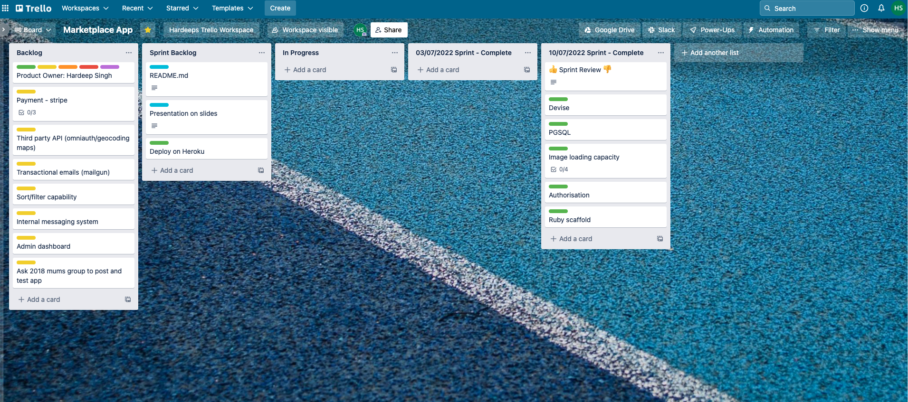  
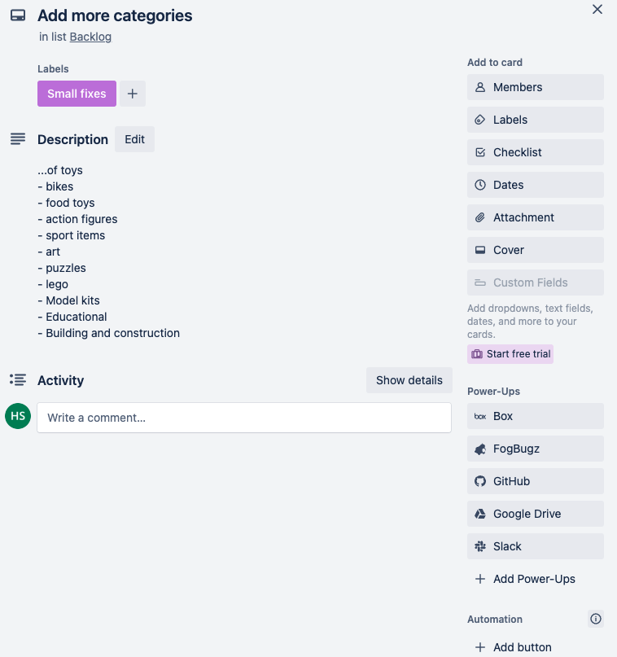  
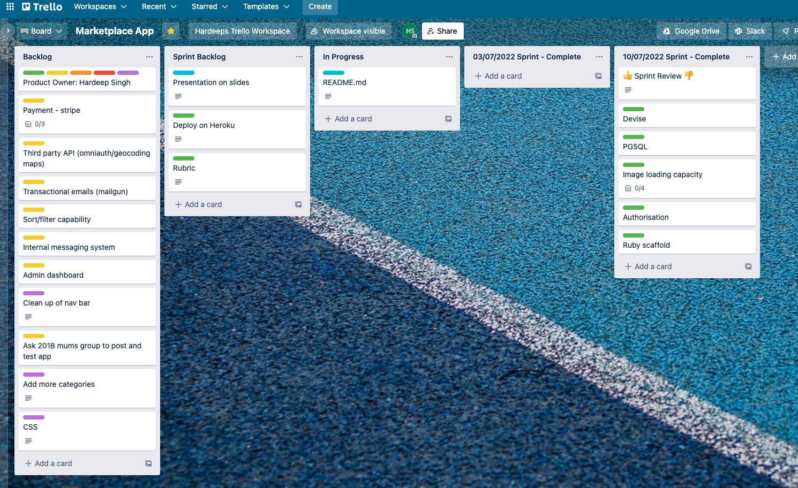  
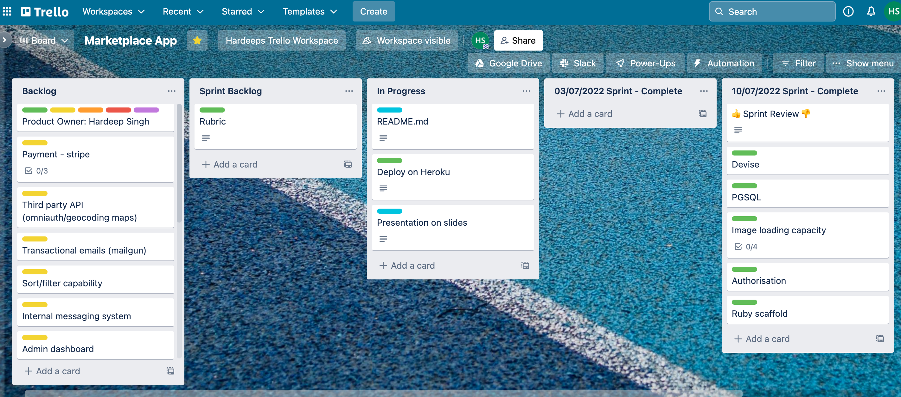  
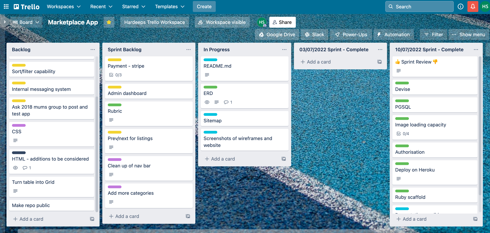